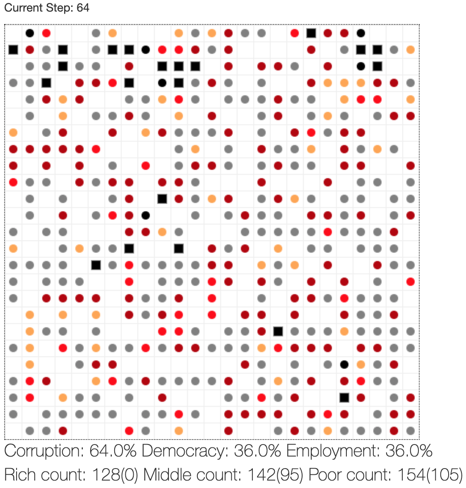
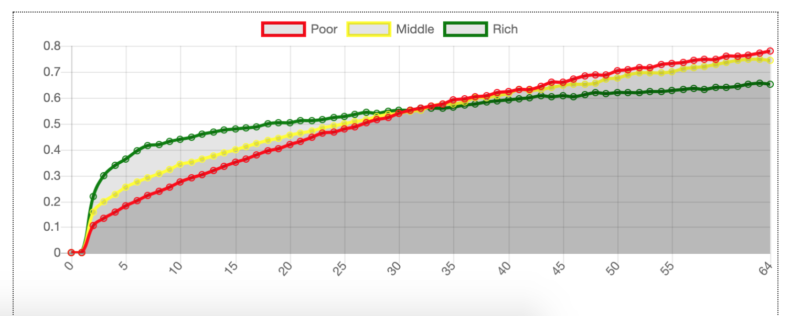
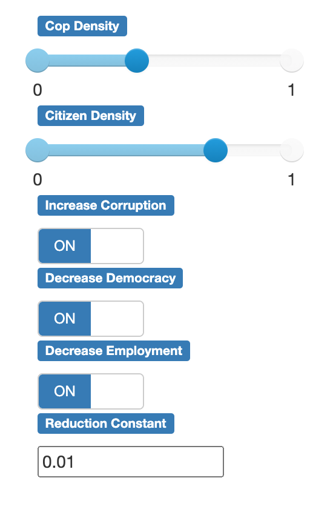

# Modelling civil disobedience using wealth in agents

We are trying to model the grievance behaviour of citizens as a measure of varying parameters such as democracy, wealth, employment and corruption. We would then deduce what amount of central forces are required to control the active agents. We aim to model the agents' behaviour in the presence of cops and how they become active or inactive as a measure of their risk aversion and their surrounding agents' total grievance. Finally, we also try to understand if wealth can also play a role in agents' civil disobedience.

## Table of content

- [Modelling Civil Violence: A Multi Agent Simulation](#modelling-civil-disobedience-using-wealth-in-agents)
- [How To Run](#how-to-run)
- [Implementation Description](#implementation-description)
  - [Model Details](#model-details)
- [Results](#results)
- [Files](#files)
- [Repository Structure](#repository-structure)

## How To Run
1. Clone the repository
2. Install `requirements.txt` via pip package manager using `$ pip install -r requirements.txt`
3. Run using `python run.py`

## Implementation Description

In the beta implementation, there are two main agents(i.e. Citizen and Cops). The task of Citizen is to revolt if the grievance is above a threshold and the task of Cops is to imprison the citizen who is in revolt state. The Cops can also eliminate the citizen based on the number of times it has been imprisoned in the past.

There are three categories in **Citizen** agent(**Poor, Middle, & Rich**) which essentially tell us about the economic status of that agent. Simultaneously, the parameters that affect the Citizen are **Democracy, Employment, Corruption**.

### Model Details

- **Citizen**

  Citizens are the core agents whose behaviour is varied during each time step depending on the change in behaviour of Central authority. The simulation is initially filled with a
  certain population ratio of citizens of varying economic status. The property of Citizen is:
    - It can revolt against the Central Authority
    - The grievance of a citizen is decided by the three global parameters(i.e. Democracy, Employment, Corruption), its economic status, its confidence.
    - It can inspect up to a certain number of cells in each direction (N, S, E and W).
    - It can perceive its neighbour(as citizen or cops)
    
- **Cops**
  
  Cops represent the central authority and are influenced by local behaviour. Cops can:
    - Jail revolting citizen
    - Eliminate excessive revolting citizen based on a threshold(*kill_threshold*).

## Results

- The grid at one step in the experiment:

   Description of colours agents will take(all agents are circles):
   
    1. Revolt agent will be grey
    2. Cop agent will be black 
    3. Rich class agent will be a tone of sour cherry
    4. Middle class agent will be red
    5. Poor class agent will be yellow
    6. Any agent that gets jailed becomes a black square
    
<p align="center">
  
</p>

- The graph which shows the grievance and the number of steps: 
<p align="center">
  
</p>

- The parameters used in the experiment: 
<p align="center">
  
</p>


## Files
- `agent/authority.py` : Contains Cops/Central authority agent class.
- `agent/env.py` : Primary environment in which placement and operations of agents take place.
- `agent/params.py` : Parameters including sliders and various constants.
- `agent/people.py` : Contains Citizen agent class.
- `agent/server.py` : Sets up server and visualization.
- `run.py` : Opens the server and port for visualization.


## Repository structure
```shell
.
├── README.md
├── agent
│   ├── __init__.py
│   ├── authority.py
│   ├── env.py
│   ├── params.py
│   ├── people.py
│   ├── portrayal.py
│   └── server.py
├── imgs
│   ├── Graph.png
│   ├── grid.png
│   └── parameters.png
├── requirements.txt
└── run.py
```
